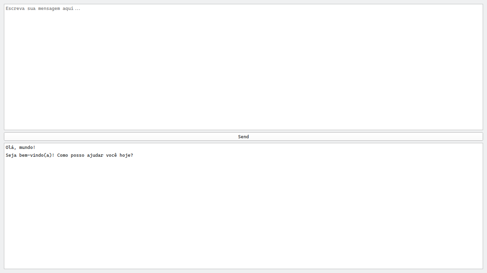

# hack-ia-mockup

***Projeto simples para testar o framework Mangaba***



# Sumário

Aplicação de desktop simples de IA que utiliza do framework Mangaba para interação.

# Utilização

```
uv run src/main.py
```

# Competências

Durante a realização deste projeto, demonstramos conhecer:

1. [Git](https://git-scm.com).
2. [GitHub](https://github.com).
3. [Markdown](https://daringfireball.net/projects/markdown).
4. [Python](https://www.python.org/).
5. [Mangaba AI](https://mangaba-ai.vercel.app/).
6. [uv](https://docs.astral.sh/uv/).
7. [Qt for Python](https://doc.qt.io/qtforpython-6/).

## Competências Adicionais

1. [EditorConfig](https://editorconfig.org).
2. [basedpyright](https://docs.basedpyright.com/latest/).
3. [Ruff](https://docs.astral.sh/ruff/).
4. [ty](https://docs.astral.sh/ty/).
